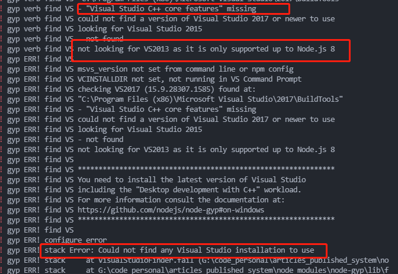
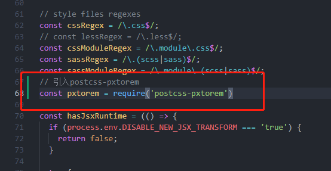
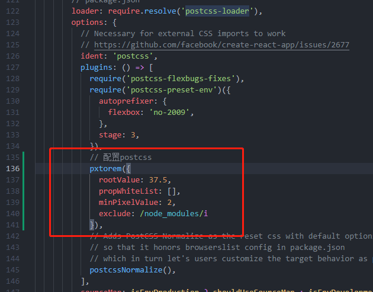

# 中文说明

## 搭建前端开发环境笔记

由`npx create-react-app articles_published_system`创建的项目

后来漏掉了`typescript`支持，原本可以由命令`npx create-react-app articles_published_system --template typescript`可以直接创建支持ts的应用

后续要将ts添加到已有项目中，用以下命令：

`npm install --save typescript @types/node @types/react @types/react-dom @types/jest`

项目中配置`sass`:

1. 执行`yarn add node-sass`下载包（按理说执行`npm install node-sass --save`也应该有用，但是我这边报错了）。

    报错如下：

    

    我的vscode和node版本都是最新的

    建议大家用`yarn`来安装项目

2. 将样式文件后缀改为`.scss`并在tsx或者js文件中引入，项目会自动编译。

为了实现自适应，给项目配置postcss-pxtorem

1. 执行`yarn add lib-flexible postcss-pxtorem`

2. 在应用入口引入`import 'lib-flexible'`

3. 执行`npm run eject`可以打开`create-react-app`应用的配置文件

4. 在`config/webpack.config.js`文件中配置postcss，位置及方法如下图：

---

# Getting Started with Create React App

This project was bootstrapped with [Create React App](https://github.com/facebook/create-react-app).

## Available Scripts

In the project directory, you can run:

### `yarn start`

Runs the app in the development mode.\
Open [http://localhost:3000](http://localhost:3000) to view it in the browser.

The page will reload if you make edits.\
You will also see any lint errors in the console.

### `yarn test`

Launches the test runner in the interactive watch mode.\
See the section about [running tests](https://facebook.github.io/create-react-app/docs/running-tests) for more information.

### `yarn build`

Builds the app for production to the `build` folder.\
It correctly bundles React in production mode and optimizes the build for the best performance.

The build is minified and the filenames include the hashes.\
Your app is ready to be deployed!

See the section about [deployment](https://facebook.github.io/create-react-app/docs/deployment) for more information.

### `yarn eject`

**Note: this is a one-way operation. Once you `eject`, you can’t go back!**

If you aren’t satisfied with the build tool and configuration choices, you can `eject` at any time. This command will remove the single build dependency from your project.

Instead, it will copy all the configuration files and the transitive dependencies (webpack, Babel, ESLint, etc) right into your project so you have full control over them. All of the commands except `eject` will still work, but they will point to the copied scripts so you can tweak them. At this point you’re on your own.

You don’t have to ever use `eject`. The curated feature set is suitable for small and middle deployments, and you shouldn’t feel obligated to use this feature. However we understand that this tool wouldn’t be useful if you couldn’t customize it when you are ready for it.

---

